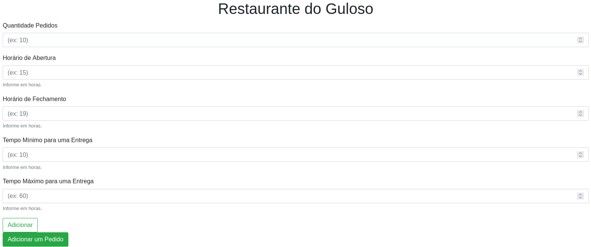
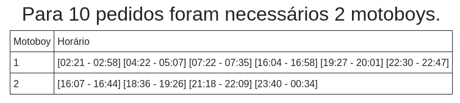
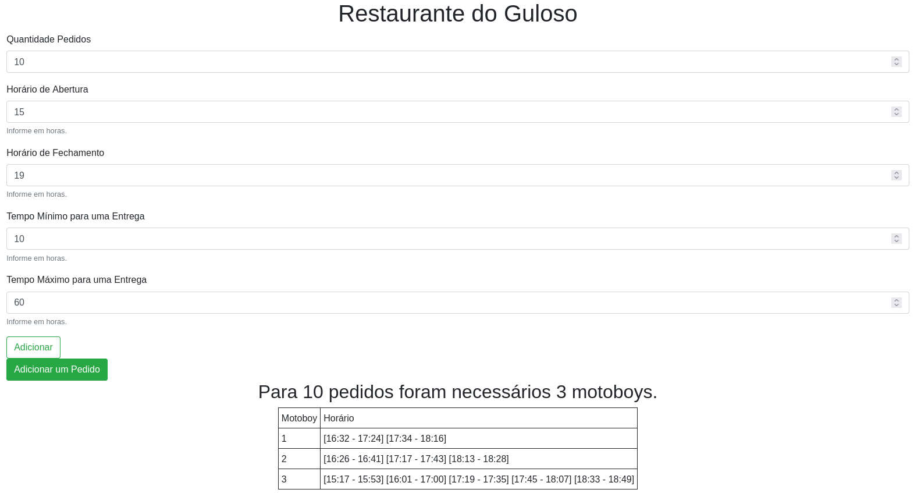

# Restaurante do Guloso

**Número da Lista**: X<br>
**Conteúdo da Disciplina**: Greed<br>

## Alunos
|Matrícula | Aluno |
| -- | -- |
| 19/0026758  |  Deivid Alves de Carvalho  |
| 19/0030879  |  João Pedro Moura Oliveira |

## Sobre 
- O Restaurante do Guloso é um famoso restaurante que busca proporcionar sempre a melhor experiência para os seus clientes, para isso sempre que um dia começa e os pedidos são feitos o gerente precisa contratar os motoboys para fazerem as entregas. O mais estranho é que o gerente sempre consegue contrar os novos motoboys, porém só tem o dinheiro necessário para o mínimo de motoboys possíveis. Por isso Jorginho (o gerente), precisa da sua ajuda para criar um algorítmo que organize os pedidos de forma que sempre sejam contradados a menor quantidade de motoboys para os pedidos.
- Entendendo um pouco mais sobre o problema, é perceptível que para resolver o problema de Jorginho é necessário utilizar um dos algorítmo ambicioso aprendidos, o <b>Interval Partitioning</b>. Com ele, sabe-se que o algorítmo irá ser ótimo e sempre serão contratados a menor quantidade possível de motoboys.
- Além disso, para que o algorítmo tenha uma melhor complexidade são utilizada duas heaps durante todo o algorítmo. A primeira heap armazena os pedidos gerados aleatoriamente pelo seu horário de início, e a segunda heap armazena os motoboys pelos seus últimos horários de entrega. Isso garante que o algorítmo funcione em uma complexidade de O(nlog(n)) e atenda as necessidade de Jorginho.
- Por fim, vale ressaltar que toda a aplicação foi feita utilizando o Django nos arquivos de views e templates.

## Screenshots
### Tela de entrada da aplicação


### Exemplo gerado pelo Interval Partitioning


### Tela inteira com um exemplo gerado


## Instalação 
**Linguagem**: python<br>
**Framework**: Django<br>

## Uso 
```bash
# Primeiro baixe o Django
$ pip install django

# Abra o servidor
$ python restaurante_do_guloso/manage.py runserver

# Acesse o localhost na porta 8000 no seu navegador
localhost:8000
```
